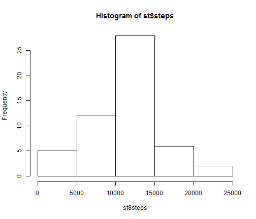
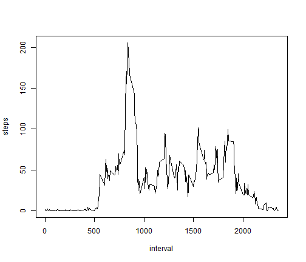
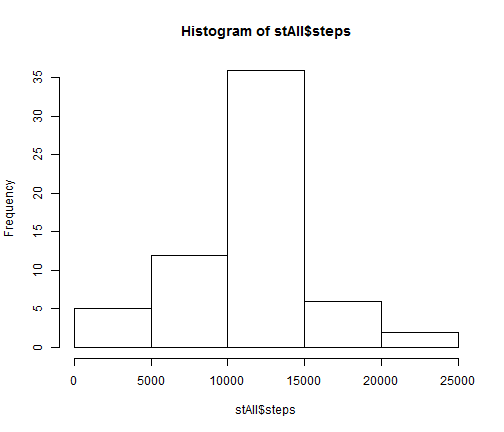
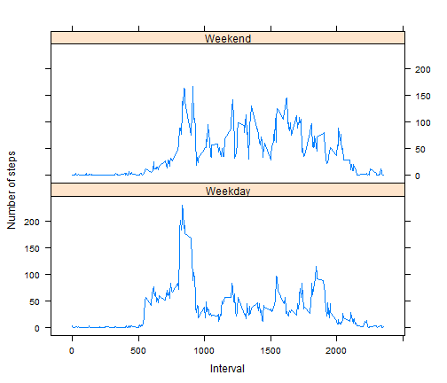

Peer Assignment - 1
========================================================
Data Set used is Activity Monitoring Data.

# Loading and Processing the data
The code first downloads the required file and then unzips it and loads the data in r.

```r
fileUrl <- "http://d396qusza40orc.cloudfront.net/repdata%2Fdata%2Factivity.zip"
if (!file.exists("repdata-data-activity.zip")) {
    download.file(fileUrl, destfile = "repdata-data-activity.zip")
}

# Unzip the file
if (!file.exists("activity.csv")) {
    unzip("repdata-data-activity.zip", overwrite = TRUE)
}

# Load data from file
df <- read.csv("activity.csv", header = TRUE)


# Convert date to date classes using as.Date() function
df$date <- as.Date(df$date, "%Y-%m-%d")
```


# Calculating the mean total number of steps taken per day
## For this part, the missing values were ignored.  Histogram is created after the sum of steps per date is taken.  


```r
histStep <- na.omit(df)
st <- data.frame(aggregate(histStep$steps ~ histStep$date, FUN = sum))
colnames(st) <- c("date", "steps")
hist(st$steps)
```

 


## Mean and Median steps per day is also calculated.

```r
mean(st$steps)
```

```
## [1] 10766
```

```r
median(st$steps)
```

```
## [1] 10765
```


# Calculating average daily activiy pattern

## Daily Activity Pattern

```r
ts <- data.frame(aggregate(histStep$steps ~ histStep$interval, FUN = mean))
colnames(ts) <- c("interval", "steps")
plot(ts, type = "l")
```

 


## The 835 interval contains the maximum number of steps.

```r
ts$interval[ts$steps == max(ts$steps)]
```

```
## [1] 835
```


# Imputing missing values

## Total number of missing values:-

```r
sum(is.na(df$steps))
```

```
## [1] 2304
```

## Strategy for filling missing values:-
A dataframe is created which contains all NA values.  In another dataframe, the mean of steps(for non NA values) for all time intervals is calcuated.  The two data frames are merged based on interval columns and the mean value of each time interval replaces the NA values.

```r
histInc <- df[!complete.cases(df), ]
incl <- data.frame(merge(histInc, ts, by.x = "interval", by.y = "interval"))
incl <- incl[, c(1, 3, 4)]
colnames(incl) <- c("interval", "date", "steps")
```

## Create a new data set that is equal to original data set but with missing data filled in:-

```r
histStepAll <- rbind(histStep, incl)
```

## Histogram of the total number of steps taken each day and Calculate and report the mean and median total number of steps taken per day:-


```r
stAll <- data.frame(aggregate(histStepAll$steps ~ histStepAll$date, FUN = sum))
colnames(stAll) <- c("date", "steps")
hist(stAll$steps)
```

 

## Mean and Median for the changed scenario
There is no difference in mean and a difference of only 1 in median from the original scenario.


```r
mean(stAll$steps)
```

```
## [1] 10766
```

```r
median(stAll$steps)
```

```
## [1] 10766
```


# Weekday - Weekend activity pattern analysis

## Including Weekday Weekend in the data frame


```r
histStepAll[, "day"] <- as.character(weekdays(histStepAll$date))
histStepAll$day[((histStepAll$day == "Saturday") | (histStepAll$day == "Sunday"))] <- "Weekend"
histStepAll$day[(histStepAll$day != "Weekend")] <- "Weekday"
histStepAll$day <- as.factor(histStepAll$day)
```


## Panel Plot containing time series for weekday and weekend analysis


```r
library(lattice)
library(grid)
gp <- data.frame(aggregate(histStepAll$steps ~ histStepAll$interval + histStepAll$day, 
    FUN = mean))
colnames(gp) <- c("interval", "day", "steps")
xyplot(gp$steps ~ gp$interval | gp$day, data = gp, type = ("l"), layout = c(1, 
    2), ylab = "Number of steps", xlab = "Interval")
```

 


